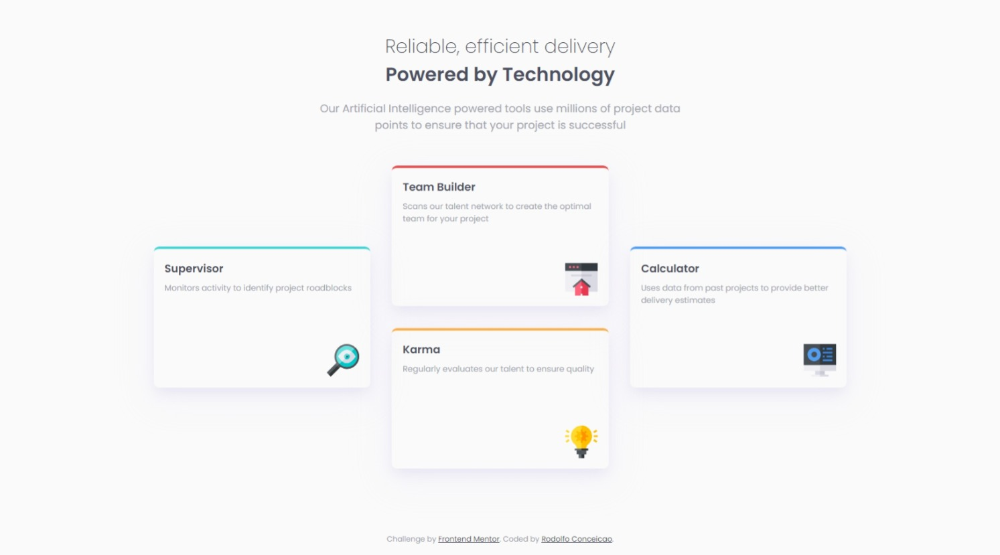
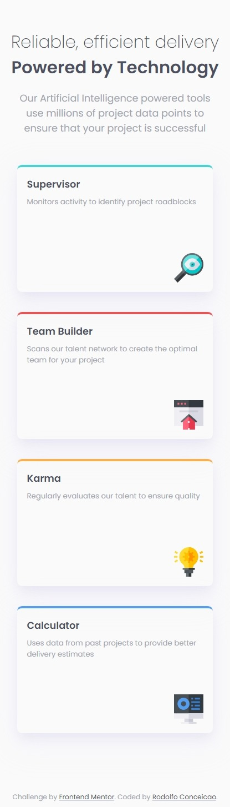

# Frontend Mentor - Four card feature section solution

This is a solution to the [Four card feature section challenge on Frontend Mentor](https://www.frontendmentor.io/challenges/four-card-feature-section-weK1eFYK). Frontend Mentor challenges help you improve your coding skills by building realistic projects. 

## Table of contents

- [Overview](#overview)
  - [The challenge](#the-challenge)
  - [Screenshot](#screenshot)
  - [Links](#links)
- [My process](#my-process)
  - [Built with](#built-with)
  - [What I learned](#what-i-learned)
  - [Continued development](#continued-development)
  - [Useful resources](#useful-resources)
- [Author](#author)
- [Acknowledgments](#acknowledgments)

## Overview

### The challenge

Users should be able to:

- View the optimal layout for the site depending on their device's screen size

### Screenshot

### Links

- Solution URL: [GitHub Repository](https://github.com/rodolfohgc/four-card-feature-section)
- Live Site URL: [GitHub Pages](https://rodolfohgc.github.io/four-card-feature-section/)

## My process

### Built with

- Semantic HTML5 markup
- CSS custom properties
- Flexbox
- Mobile-first workflow

### What I learned

Probably the worst thing here was trying to do the card shadows manually, so I decided to use an on-line tool more intuitive.

### Continued development

I always relay on flexbox when working in responsive layouts, but I know I need to practice with Grids too. Looking forward to apply it in the future.

### Useful resources

- [Material Design Box Shadows](https://htmlcssfreebies.com/material-design-box-shadows/) - It's impossible to do complex and good-looking box shadows manually, so this tool is really helpful.
- [CSS Flexbox Layout Guide | CSS-tricks](https://css-tricks.com/snippets/css/a-guide-to-flexbox/) - This was one of the firsts guides I studied when learning Flexbox and it's in my bookmarks since then.

## Author

- Frontend Mentor - [@rodolfohgc](https://www.frontendmentor.io/profile/rodolfohgc)
- Twitter - [@rodolfohgc](https://www.x.com/rodolfohgc)
- GitHub - [@rodolfohgc](https://github.com/rodolfohgc)
- Instagram - [@rodolfohgc](https://www.instagram.com/rodolfohgc/)